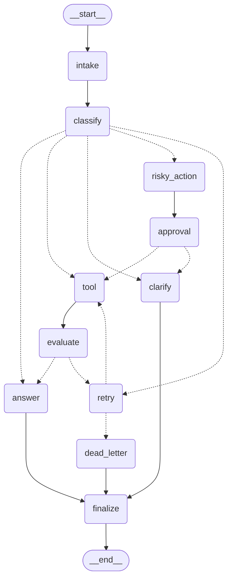

# Báo cáo Lab Day 08 — LangGraph Agentic Orchestration

> Số liệu: `outputs/metrics.json` thực tế (success_rate 100%, 3 retries)

## 1. Thông tin
- **Sinh viên:** Võ Huyền Khánh Mây - 2A202600858
- **Repo/commit:** 6d8252d
- **Ngày:** 2026-06-29
- **LLM:** OpenAI `gpt-4o-mini` — `classify_node` dùng `.with_structured_output(IntentClassification)`,
  `answer_node` sinh câu trả lời grounded từ `tool_results` / `approval` / `query`.

## 2. Kiến trúc graph

11 node, mọi nhánh hội tụ tại `finalize → END`. Sơ đồ thực tế (xuất bằng `draw_mermaid()`):



- `intake`: chuẩn hóa query.
- `classify`: **LLM** + structured output → 1 trong 5 route (ưu tiên risky > tool > missing_info > error > simple).
- `tool` → `evaluate` → `retry`: vòng lặp retry **có giới hạn** (`attempt < max_attempts`); vượt giới hạn → `dead_letter`.
- `risky_action` → `approval`: nhánh HITL cho hành động rủi ro (mock approve mặc định; `interrupt()` khi bật `LANGGRAPH_INTERRUPT=true`).
- `clarify`: hỏi lại khi thiếu thông tin.
- `dead_letter`: escalate khi hết retry, vẫn trả `final_answer` cho khách.
- `finalize`: phát audit event cuối, điểm hội tụ trước END.

## 3. State schema & reducers

| Field | Reducer | Vì sao |
|---|---|---|
| route, risk_level, attempt, max_attempts, final_answer | overwrite | chỉ giữ trạng thái hiện tại |
| evaluation_result, pending_question, proposed_action, approval | overwrite | giá trị mới nhất, không cần lịch sử |
| messages, tool_results, errors, events | append (`Annotated[list, add]`) | nhật ký audit phục vụ chấm & debug |

## 4. Kết quả scenario *(`outputs/metrics.json`)*

| Scenario | Expected | Actual | Success | Retries | Interrupts | Nodes |
|---|---|---|:--:|--:|--:|--:|
| S01_simple | simple | simple | ✅ | 0 | 0 | 4 |
| S02_tool | tool | tool | ✅ | 0 | 0 | 6 |
| S03_missing | missing_info | missing_info | ✅ | 0 | 0 | 4 |
| S04_risky | risky | risky | ✅ | 0 | 1 | 8 |
| S05_error | error | error | ✅ | 2 | 0 | 10 |
| S06_delete | risky | risky | ✅ | 0 | 1 | 8 |
| S07_dead_letter | error | error | ✅ | 1 | 0 | 5 |

- **Tổng hợp:** success_rate = **100%** (7/7), total_retries = **3**, total_interrupts = **2**, avg_nodes_visited = **6.43**, resume_success = **true**.
- **Giải thích vì sao số như vậy:**
  - S05: route `error`, `max_attempts=3` → `tool` trả ERROR ở lần đầu (attempt 1 < 2), retry lần 2 thì thành công ⇒ **2 retry**.
  - S07: route `error`, `max_attempts=1` → sau 1 retry, `1 < 1` sai ⇒ vào thẳng `dead_letter` ⇒ **1 retry**, không gọi tool.
  - S04 & S06: route `risky` → đi qua node `approval` ⇒ mỗi cái **1 interrupt**; `approval` không None nên thỏa điều kiện `requires_approval`.

## 5. Phân tích lỗi (failure modes)

1. **Tool fail tạm thời → retry có giới hạn:** `tool_node` trả chuỗi `ERROR` khi `route=='error'` và `attempt<2`; `evaluate_node` phát hiện và lặp `tool→evaluate→retry` tối đa `max_attempts` lần. Không bao giờ lặp vô hạn nhờ `route_after_retry` (bound bằng `attempt < max_attempts`).
2. **Hành động rủi ro chưa duyệt:** route `risky` **bắt buộc** đi qua `approval` trước khi `tool` thực thi; nếu bị từ chối → `clarify` (xin phương án khác) thay vì thực thi mù quáng. Tránh refund/delete ngoài ý muốn.

## 6. Persistence / recovery

- Checkpointer được gắn khi `compile`; mỗi run dùng `thread_id` riêng (`thread-<scenario_id>`).
- Bản SQLite (`scripts/demo_resume.py`) chứng minh: graph dừng tại `interrupt()` ở node `approval`, **sống sót qua "crash"** (dựng graph mới trỏ cùng `checkpoints.db` + cùng `thread_id`) và `resume` đúng từ checkpoint trên đĩa; `get_state_history()` cho phép time-travel.
```log 
(.venv) C:\Users\ADMIN\source\2A202600858-VoHuyenKhanhMay-phse2-track3-day8-langgraph-agent>python scripts/demo_resume.py
== Run 1: graph interrupted ==
interrupt payload: [Interrupt(value={'proposed_action': 'PROPOSED ACTION (needs human approval): Refund this customer and send email', 'question': 'Approve this action? reply approved=true/false'}, id='59008aa189923fd2347c8adead378926')]

== Run 2 (new process object): RESUMED ==
final_answer: Hello,

Thank you for your request. I’m happy to inform you that your refund has been approved and will be processed shortly. An email confirmation will be sent to you once the refund is completed.

If you have any further questions or need assistance, feel free to reach out.

Best regards,  
[Your Name]  
Customer Support

== State history (newest -> oldest) ==
  next=() | route=risky | attempt=0
  next=('finalize',) | route=risky | attempt=0
  next=('answer',) | route=risky | attempt=0
  next=('evaluate',) | route=risky | attempt=0
  next=('tool',) | route=risky | attempt=0
  next=('approval',) | route=risky | attempt=0
  next=('risky_action',) | route=risky | attempt=0
  next=('classify',) | route= | attempt=0
  next=('intake',) | route= | attempt=0
  next=('__start__',) | route=risky | attempt=0
  next=() | route=risky | attempt=0
  next=('finalize',) | route=risky | attempt=0
  next=('answer',) | route=risky | attempt=0
  next=('evaluate',) | route=risky | attempt=0
  next=('tool',) | route=risky | attempt=0
  next=('approval',) | route=risky | attempt=0
  next=('risky_action',) | route=risky | attempt=0
  next=('classify',) | route= | attempt=0
  next=('intake',) | route= | attempt=0
  next=('__start__',) | route= | attempt=0
  next=('classify',) | route= | attempt=0
  next=('intake',) | route= | attempt=0
  next=('__start__',) | route=None | attempt=None

```

## 7. Extension đã làm

- **SQLite persistence + crash-resume**  — `persistence.py` + `scripts/demo_resume.py`.
- **LangGraph Studio / LangSmith UI** — `langgraph dev` để chạy graph trực quan + duyệt HITL, không tự code UI.
- **Mermaid diagram** — `outputs/graph.mmd` + `outputs/graph.png` (xuất bằng `scripts/export_graph.py`).
- **Audit-event trace** — `outputs/traces/*.json` (xuất bằng `scripts/dump_traces.py`).
- **RAG grounded Q&A** — retriever embeddings + knowledge base, đạt **10/10** trên bộ chấm `data/grading_questions.json` (chi tiết ở mục 9).

# Ảnh UI


## 8. Kế hoạch cải tiến

Nếu có thêm 1 ngày: thay heuristic ở `evaluate_node` bằng **LLM-as-judge** có rubric; thêm **fan-out song song** (`Send`) khi cần gọi nhiều tool; **idempotency key** cho hành động rủi ro để tránh refund/delete trùng; **circuit breaker** + cảnh báo khi tỷ lệ vào `dead_letter` tăng.

## 9. Extension — RAG grounded Q&A trên bộ dataset chấm điểm

Bộ `data/grading_questions.json` (10 câu hỏi tiếng Việt về chính sách nội bộ) là một **RAG evaluation**: chấm câu trả lời theo `must_contain_any` / `must_not_contain`, và **top-1 retrieval** phải đúng `expect_top1_doc_id`. Lab Day 08 gốc chỉ có mock tool, nên tôi bổ sung một pipeline **RAG có dẫn nguồn** để trả lời các câu này.

**Cách làm:**
- **Knowledge base** (`data/knowledge_base/`): 7 tài liệu — 5 tài liệu chính (`policy_refund_v4`, `sla_p1_2026`, `it_helpdesk_faq`, `hr_leave_policy`, `access_control_sop`) + **2 tài liệu nhiễu bản cũ** (`policy_refund_v3` ghi "14 ngày", `hr_leave_policy_2025` ghi "10 ngày phép") để buộc retriever chọn đúng bản **hiện hành**.
- **Retriever** (`src/langgraph_agent_lab/retrieval.py`): OpenAI `text-embedding-3-small` + cosine similarity → lấy **top-1** tài liệu.
- **Grounded answer**: LLM chỉ trả lời dựa trên tài liệu top-1 (không được bịa).
- **Grader** (`scripts/run_grading_rag.py`): chấm 3 tiêu chí, ghi `outputs/grading_results.json`.

**Kết quả (thực chạy):**

| Chỉ số | Giá trị |
|---|---|
| Tổng câu | 10 |
| Retrieval accuracy (top-1 đúng doc) | **100%** |
| Answer pass (contains + not-contains) | **100%** |
| Overall pass | **100% (10/10)** |

| ID | Câu hỏi (tóm) | Đáp án của agent | Top-1 doc | Ret | Ans | Pass |
|---|---|---|---|:--:|:--:|:--:|
| gq_d10_01 | Hạn gửi yêu cầu hoàn tiền | 7 ngày làm việc | policy_refund_v4 | ✅ | ✅ | ✅ |
| gq_d10_02 | SP bị loại khỏi hoàn tiền | hàng kỹ thuật số, license key, subscription | policy_refund_v4 | ✅ | ✅ | ✅ |
| gq_d10_03 | Finance Team xử lý bao lâu | 3-5 ngày làm việc | policy_refund_v4 | ✅ | ✅ | ✅ |
| gq_d10_04 | SLA phản hồi P1 | 15 phút | sla_p1_2026 | ✅ | ✅ | ✅ |
| gq_d10_05 | SLA resolution P1 | 4 giờ | sla_p1_2026 | ✅ | ✅ | ✅ |
| gq_d10_06 | Auto escalate P1 sau | 10 phút | sla_p1_2026 | ✅ | ✅ | ✅ |
| gq_d10_07 | Khóa TK sau mấy lần sai | 5 lần | it_helpdesk_faq | ✅ | ✅ | ✅ |
| gq_d10_08 | VPN tối đa mấy thiết bị | 2 thiết bị | it_helpdesk_faq | ✅ | ✅ | ✅ |
| gq_d10_09 | Phép năm <3 năm (HR 2026) | 12 ngày phép năm | hr_leave_policy | ✅ | ✅ | ✅ |
| gq_d10_10 | Level 4 Admin duyệt bởi ai | IT Manager và CISO | access_control_sop | ✅ | ✅ | ✅ |

**Bằng chứng eval "thật" (không trivial):** ở các câu có bản cũ gây nhiễu, retriever vẫn xếp đúng bản hiện hành lên top-1 — hoàn tiền `policy_refund_v4` (0.67) > `policy_refund_v3` (0.59); phép năm `hr_leave_policy` 2026 (0.76) > `hr_leave_policy_2025` (0.69). Nhờ vậy câu trả lời nêu đúng "7 ngày"/"12 ngày" và **không** dính "14 ngày"/"10 ngày" → đạt cả `must_contain_any` lẫn `must_not_contain`.

**Chạy lại:**

```powershell
.\.venv\Scripts\python.exe scripts\run_grading_rag.py
```
